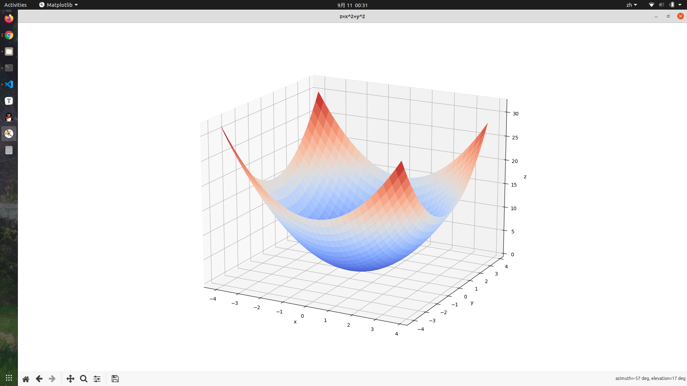
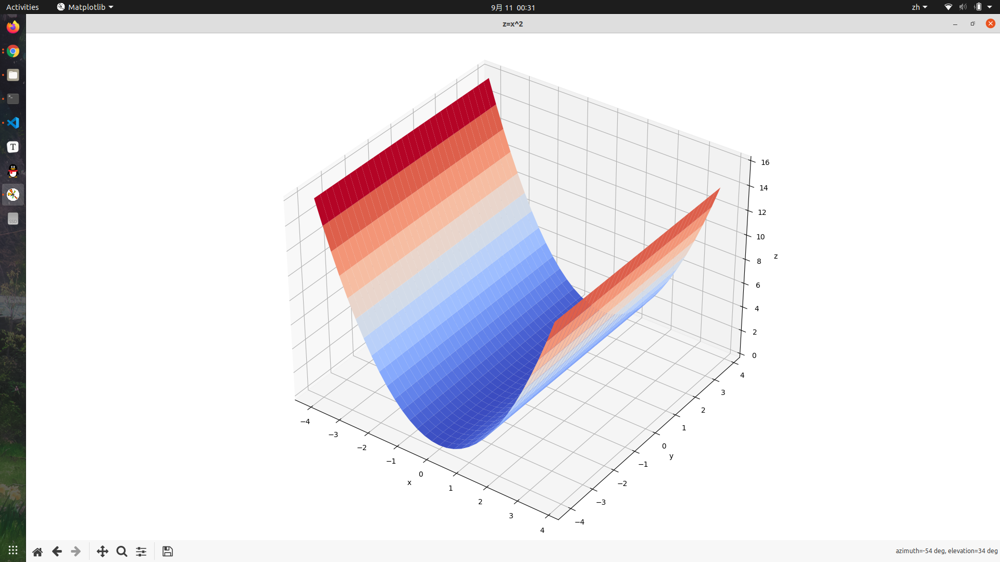
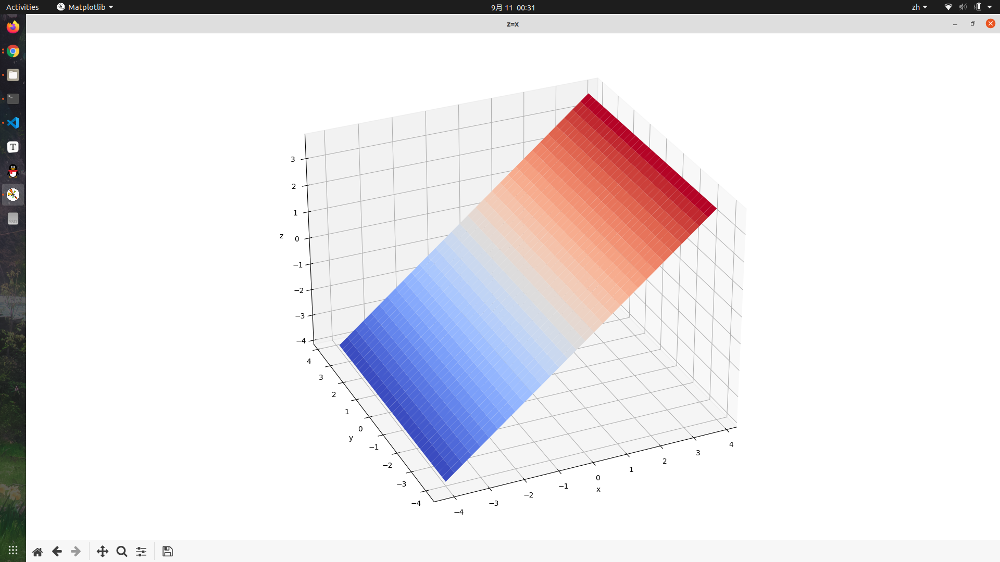

# 3D Function Graphing
> Christopher TJU
* Based on Python
* Easy to use
## USAGE
* `pip install -r requirememts.txt` to install dependency.
* Key in the function f(x, y) to form a function z=f(x, y), then Press enter.
* End the programme by pressing "Ctrl + c".
* To save the figure or Editing axis or so, feel free to edit the source code.
## Ideas
>The inital idea came from Vicky, who once asked me How it looks like the function "z=y^2/x".

>Well, I hadn't had much memory about that since I'd already finished my Calculus Classes. So, I relied her with this Programme.
## Intuitions
>Look at the function z = y^2 / x and think about other possible functions we might need in the future. It can be hard to pre-set all kinds of functions (or combinations of x, y and z). So, here I came up with the idea of viewing the function as z equals to a 2-variable-function f(x,y), meaning that by calculating all z value deciding by a set (x, y), we get the proximate graph of the function. 

>To deal with the function f(x,y), we think of it as an expressions. Then, by using the regular expression method, we are able to cut the expression into tokens, each representing a number, an operator or variables (x or y).

>Till now, a last problem ahead is to process it much faster and easier. This is when it suddenly occurs to me that Numpy, a tool for matrix processing is perfect for it. 

>Coding while checking the reference doc, it took me half day to complete this half-finished-but-useful-python-based-3D-function-Graphing tool.

>Hope you enjoy.

## SAMPLE

### sample 1
$$
z=x^2+y^2
$$

### sample 2
$$
z=x^2
$$

### sample 3

$$
z=x
$$

